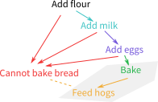
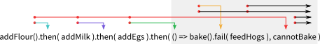

# JavaScript challenges

The challenges in this repository examine some special features in JavaScript which are
less common in other languages. Note that this is code which has to be corrected, i.e. it 
does *NOT* follow good practises! You have to write good code by yourself. 

Run them e.g. in WebStorm directly, or with node.js from the command line, to see the output.

There are also **Q Challenges** for the library [Q](https://www.npmjs.com/package/q) which examine
some common asynchronous situations. To get started, first install the required npm modules:

    npm install

References:

* **[GP]** *JavaScript: The Good Parts* by Donald Crockford
* **[JP]** *JavaScript Patterns* by Stoyan Stefanov

(*GP:37, Closure* means The Good Parts, Page 37, Chapter about Closure)

#### Closure (access to parent scope)

See *GP:37, Closure* and *JP:107, Private Static Members*

When a variable does not exist in the local scope, the compiler follows the scope tree
up to the top until it finds it there (or not).

    var a = 42;
    function test() {
        console.log( a ); // Prints 42
    }

This allows to implement private variables as well.

#### Invocation

See *JP:64, Callbacks and Scope* and *GP:27, Invocation*

The `this` object is bound to the global object for function calls (different for 
[array functions](https://developer.mozilla.org/en-US/docs/Web/JavaScript/Reference/Functions/Arrow_functions)!).

#### Array Functions

See [Array.prototype.map()](https://developer.mozilla.org/en-US/docs/Web/JavaScript/Reference/Global_Objects/Array/map),
[Array.prototype.forEach()](https://developer.mozilla.org/en-US/docs/Web/JavaScript/Reference/Global_Objects/Array/forEach)
and others.

## Q Challenges

See the [Q documentation](https://github.com/kriskowal/q) for further details.

#### Barrier (wait for multiple asynchronous results)

`Q.all` waits until all promises are completed.

#### Propagation

In asynchronous situations, one might have a situation like the following where arrows to the left show errors (i.e.
the promise was rejected), and arrows to the right show a successful call.

In Q, `resolve`s and `reject`s are passed on until they are handled (see the Propagation chapter in the documentation).
A straight-forward attempt could look like this:

If `addFlour()` fails, Q skips all following success handlers until it arrives at the first error handler `cannotBake()`.
Unfortunately, if `cannotBake()` is successful, execution continues and `bake()` is executed as well. For this case,
it is necessary to create another execution branch.

`bake()` now ends directly or with `feedHogs()`.
